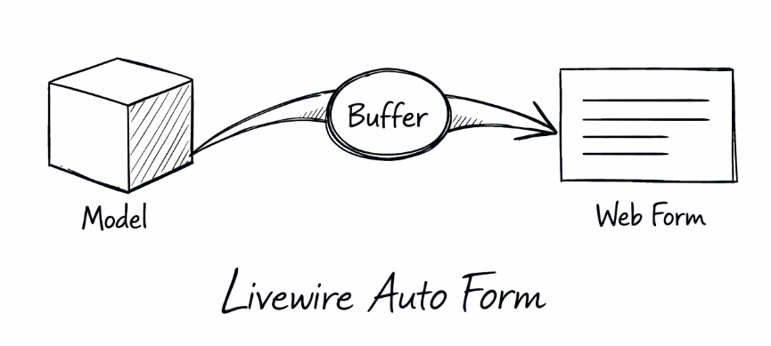

[](https://github.com/schenke-io/livewire-auto-form/blob/main/LICENSE.md)
[](https://packagist.org/packages/schenke-io/livewire-auto-form)
[](https://github.com/schenke-io/livewire-auto-form/actions/workflows/run-tests.yml)
[](https://packagist.org/packages/schenke-io/livewire-auto-form)
[](https://packagist.org/packages/schenke-io/livewire-auto-form)

<!--
********************************************************************************
*                                                                              *
*     DO NOT EDIT THIS FILE MANUALLY! IT WILL BE OVERWRITTEN.                  *
*                                                                              *
*     This file was generated by: workbench/app/Console/Commands/WriteMarkdownCommand.php
*     Source files are located in: workbench/resources/md
*
*     If you want to change the content, edit the source files instead.        *
*                                                                              *
********************************************************************************
-->


Stop manually mapping every Eloquent attribute to a Livewire property and start focusing on your app's core logic with our buffer-based form management.

**If you struggle with the following problems, we are just for you:**

*   **Tedious property definitions:** Tired of manually adding `public string $name` for every model attribute? Our single-buffer architecture handles it all.
*   **"Forgot-to-save" bugs:** Eliminate accidental data loss with centralized state management and predictable auto-save logic.
*   **Relationship boilerplate:** Editing child models shouldn't be hard. Handle relationships with simple method calls and zero extra code.
*   **Rigid workflows:** Switch between real-time "auto-save" and traditional "Save" buttons effortlessly, without rewriting your component.
*   **Complex Wizard Workflows:** Building multi-step forms usually requires manual state management for steps. Our Wizard support automates navigation and validation.
*   **Complex testing:** Logic consistency means fewer edge cases and easier unit testing for your form components.

# Concept of Coding

Livewire Auto Form follows a **buffer-based state management** pattern. Instead of binding Livewire properties directly to Eloquent model attributes, it uses an internal `$form` object (an instance of `FormCollection`) to safely stage changes.

### Core Principles

*   **State Isolation:** All form data resides in a single `$form` buffer. This prevents accidental model mutations and allows for easy "undo" or "cancel" operations. Since `$form` is a `FormCollection` (implementing `ArrayAccess`, `Countable`, `IteratorAggregate`, and `Wireable`), it provides rich state management beyond a simple array.
*   **Convention over Configuration:** By extending `AutoForm` and calling `setModel($model)`, the package manages field hydration and state transitions. Relationships and validation rules are defined in the component to maintain full control.
*   **Context Switching:** Swap the active model within the same component seamlessly. You can move between the root model and its relations, or even switch between different instances of the same model type (the **"List & Edit"** pattern). The package manages the state transition and buffer hydration automatically.
*   **Automatic Persistence:** Choose between real-time updates (`autoSave = true`) or manual submission. The package handles Eloquent `save()` calls and validation.
*   **Multi-Step Workflows:** Use `AutoWizardForm` to split large forms into sequential steps with per-step validation and explicit field mapping.

This approach ensures that your components remain clean, predictable, and easy to test.

### Installation

```bash
composer require schenke-io/livewire-auto-form
```

* [Concept of Coding](#concept-of-coding)
    * [Core Principles](#core-principles)
    * [Installation](#installation)
* [Code Examples](#code-examples)
    * [1. The Basic Form (Manual Save)](#1-the-basic-form-manual-save)
    * [2. Modern "Auto-Save" Experience](#2-modern-auto-save-experience)
    * [3. Handling Relationships](#3-handling-relationships)
    * [4. Using Enums for Selects](#4-using-enums-for-selects)
    * [5. Listening for Events (Notifications)](#5-listening-for-events-notifications)
    * [6. List & Edit Pattern](#6-list-edit-pattern)
    * [7. Multi-Step Wizard](#7-multi-step-wizard)
* [Multi-Step Wizards](#multi-step-wizards)
    * [Magic Features](#magic-features)
    * [Configuration](#configuration)
    * [API Reference](#api-reference)
    * [Full Example](#full-example)
* [API Definitions](#api-definitions)
  * [Using AutoForm](#using-autoform)
  * [Using AutoWizardForm](#using-autowizardform)
    * [Public Properties (AutoWizardForm)](#public-properties-autowizardform)
    * [Public Methods (AutoWizardForm)](#public-methods-autowizardform)
  * [Public Properties (AutoForm)](#public-properties-autoform)
    * [The $form object (FormCollection)](#the-form-object-formcollection)
  * [View Actions (Public Interface)](#view-actions-public-interface)
    * [`edit(string $relation, int|string $id)`](#edit-string-relation-int-string-id)
    * [`add(string $relation)`](#add-string-relation)
    * [`save()`](#save)
    * [`cancel()`](#cancel)
    * [`delete(string $relation, int|string $id)`](#delete-string-relation-int-string-id)
  * [Calling Methods from Blade](#calling-methods-from-blade)
  * [Helper Methods](#helper-methods)
    * [`getRelationList(string $relation)`](#getrelationlist-string-relation)
    * [`isEdited(string $relation, int|string $id)`](#isedited-string-relation-int-string-id)
    * [`getModel()`](#getmodel)
    * [`getActiveModel()`](#getactivemodel)
    * [`optionsFor(string $key, ?string $labelMask = null)`](#optionsfor-string-key-string-labelmask-null)
  * [Events](#events)
  * [Exceptions](#exceptions)

# Code Examples

This guide provides examples for using the package, ranging from basic forms to more advanced scenarios.

> **Note on Method Calls:** Since the form logic is integrated directly into the component, you can call methods like `save()` or `edit()` directly in Blade. This ensures full compatibility with Alpine.js and component libraries like **Flux** without the need for wrapper methods. See [API Definitions](definitions.md#calling-methods-from-blade) for details.

### 1. The Basic Form (Manual Save)

This is the simplest way to use the package. You extend `AutoForm` in your component and initialize it.

**The Livewire Component:**
```php
use SchenkeIo\LivewireAutoForm\AutoForm;

class EditPost extends AutoForm
{
    public function mount(Post $post)
    {
        $this->setModel($post);
    }

    public function rules(): array
    {
        return [
            'title' => 'required|string|min:3',
            'content' => 'required',
        ];
    }

    public function render()
    {
        return view('livewire.edit-post');
    }
}
```

**The Blade View:**
```html
<div>
    <input type="text" wire:model="form.title">
    @error('form.title') <span class="error">{{ $message }}</span> @enderror

    <textarea wire:model="form.content"></textarea>
    @error('form.content') <span class="error">{{ $message }}</span> @enderror
    
    <button wire:click="save">Save Post</button>
</div>
```

---

### 2. Modern "Auto-Save" Experience

If you want your form to save automatically as the user types (on blur), just set `$this->autoSave` to `true`.

**The Livewire Component:**
```php
class EditPost extends AutoForm
{
    public function mount(Post $post)
    {
        $this->setModel($post);
        $this->autoSave = true;
    }

    public function rules(): array
    {
        return [
            'title' => 'required|string|min:3',
            'content' => 'required',
        ];
    }
}
```

**The Blade View:**
```html
<div>
    <!-- No "Save" button needed! It saves when you click away from the input (on blur) -->
    <input type="text" wire:model.blur="form.title">
    @error('form.title') <span class="error">{{ $message }}</span> @enderror

    <textarea wire:model.blur="form.content"></textarea>
    @error('form.content') <span class="error">{{ $message }}</span> @enderror
    
    <span wire:loading wire:target="save">Saving...</span>
</div>
```

---

### 3. Handling Relationships

This is where the package really shines. Imagine a `Brand` that has many `Products`. You can edit the brand and its products in the same component.

**The Livewire Component:**
```php
class EditBrand extends AutoForm
{
    public function mount(Brand $brand)
    {
        $this->setModel($brand);
    }

    public function rules(): array
    {
        return [
            'name' => 'required',
            'products.name' => 'required',
            'products.price' => 'numeric',
        ];
    }

    public function render()
    {
        return view('livewire.edit-brand');
    }
}
```

**The Blade View:**
```html
<div>
    <!-- Main Brand Form -->
    <input type="text" wire:model.blur="form.name">

    <h3>Products</h3>
    <ul>
        @foreach($this->getRelationList('products') as $product)
            <li wire:key="product-{{ $product->id }}" 
                class="{{ $this->isEdited('products', $product->id) ? 'active' : '' }}">
                {{ $product->name }} - ${{ $product->price }}
                <button wire:click="edit('products', {{ $product->id }})">Edit</button>
                <button wire:click="delete('products', {{ $product->id }})">Delete</button>
            </li>
        @endforeach
    </ul>
    
    <button wire:click="add('products')">Add Product</button>

    <!-- This shows up only when we are editing or adding a product -->
    @if($activeContext === 'products')
        <div class="modal">
            <h4>{{ $activeId ? 'Edit Product' : 'Add Product' }}</h4>
            
            <!-- Relationship form is stored under the relationship name in the $form buffer -->
            <input type="text" wire:model.blur="form.products.name">
            <input type="number" wire:model.blur="form.products.price">
            
            <button wire:click="save">Save</button>
            <button wire:click="cancel">Cancel</button>
        </div>
    @endif
</div>
```

---

### 4. Using Enums for Selects

If your model uses PHP Enums (like a `Status` enum), the package can automatically generate options for your select dropdowns.

**The Livewire Component:**
```php
// Define rules that include the attribute
public function rules(): array
{
    return [
        'status' => 'required',
    ];
}
```

**The Blade View:**
```html
<select wire:model.blur="form.status">
    <option value="">Select Status</option>
    @foreach($this->optionsFor('status') as $option)
        <option value="{{ $option[0] }}">{{ $option[1] }}</option>
    @endforeach
</select>
```

The package looks at your model's `$casts` to find the Enum and creates readable labels automatically!

---

### 5. Listening for Events (Notifications)

You can listen for the events dispatched by the component to show "Saved" notifications or other UI feedback.

**The Blade View (using Alpine.js):**
```html
<div x-data="{ show: false, message: '' }"
     x-on:saved.window="show = true; message = 'Changes saved!'; setTimeout(() => show = false, 2000)"
     x-on:field-updated.window="show = true; message = 'Field updated!'; setTimeout(() => show = false, 2000)">
    
    <div x-show="show" class="notification" style="display: none;">
        <span x-text="message"></span>
    </div>

    <!-- your form content ... -->
</div>
```

---

### 6. List & Edit Pattern

You can use a single component to manage a collection of models, allowing you to select and edit any record from a list, or create a new one, all within the same view state.

**The Livewire Component:**
```php
class ManageProducts extends AutoForm
{
    public function mount()
    {
        $this->setModel(new Product);
    }

    public function rules(): array
    {
        return [
            'name' => 'required',
            'price' => 'numeric',
        ];
    }
}
```

**The Blade View:**
```html
<div>
    <!-- 1. The List -->
    <ul>
        @foreach(Product::all() as $product)
            <li>
                {{ $product->name }}
                <button wire:click="edit('', {{ $product->id }})">Edit</button>
                <button wire:click="delete('', {{ $product->id }})">Delete</button>
            </li>
        @endforeach
    </ul>

    <button wire:click="add('')">Create New Product</button>

    <hr>

    <!-- 2. The Edit/Create Form -->
    <h3>{{ $form->rootModelId ? 'Edit Product' : 'New Product' }}</h3>
    
    <input type="text" wire:model.blur="form.name">
    <input type="number" wire:model.blur="form.price">
    
    <button wire:click="save">Save Product</button>
    <button wire:click="cancel">Reset Form</button>
</div>
```

---

### 7. Multi-Step Wizard

For complex forms, extend `AutoWizardForm` to break them into steps. It handles step navigation, explicit field mapping, and per-step validation.

**The Livewire Component:**
```php
class UserWizard extends AutoWizardForm
{
    public array $structure = [
        'profile' => ['name'],
        'address' => ['city'],
    ];
    
    public string $stepViewPrefix = 'livewire.steps.';

    public function rules(): array
    {
        return [
            'name' => 'required',
            'city' => 'required',
        ];
    }
    
    public function mount(User $user)
    {
        $this->setModel($user);
        parent::mount();
    }
}
```

**The Main Blade View:**
```html
<form wire:submit.prevent="submit">
    @foreach($this->getSteps() as $index => $step)
        @include('livewire.steps.' . $step, ['isActive' => $this->isStepActive($index)])
    @endforeach

    <button type="submit">{{ $this->isLastStep() ? 'Finish' : 'Next' }}</button>
</form>
```

# Multi-Step Wizards

The `AutoWizardForm` extends the core `AutoForm` functionality to support complex, multi-step workflows with ease. It handles step navigation, per-step validation, and a unified submission flow.

### Magic Features

- **Unified `submit()` Flow**: A single `submit()` method handles both navigating to the next step (with validation) and final persistence when the last step is reached.
- **Progress Integrity**: Before final saving, the wizard performs an integrity check to ensure that all fields defined in your `rules()` were actually present in at least one of the steps. If any field is missing, a `LivewireAutoFormException` is thrown.

### Configuration

To create a wizard, extend `AutoWizardForm` and configure the following:

- **`$structure`**: A map of Blade view names to field names (e.g., `['step-one' => ['field1', 'field2'], 'step-two' => ['field3']]`).
- **`$stepViewPrefix`**: A prefix for the views defined in `$structure` (e.g., `livewire.user-wizard-steps.`).
- **`rules()`**: Define your validation rules.
- **`mount()`**: Initialize the model with `setModel($model)`.

### API Reference

| Method | Description |
| --- | --- |
| `submit()` | Handles both transitions and final saving. Calls `next()` or `save()`. |
| `next()` | Validates current step's fields and moves forward. |
| `previous()` | Moves to the previous step. |
| `isLastStep()` | Returns `true` if on the final step. |
| `getSteps()` | Returns the list of defined step views. |
| `isStepActive(int $index)` | Checks if a step is currently active. |

### Full Example

**1. The Livewire Component:**

```php
namespace App\Livewire;

use App\Models\User;
use SchenkeIo\LivewireAutoForm\AutoWizardForm;

class UserWizard extends AutoWizardForm
{
    public array $structure = [
        'profile' => ['name', 'email'],
        'address' => ['city'],
        'preferences' => ['marketing_opt_in']
    ];
    
    public string $stepViewPrefix = 'livewire.user-wizard-steps.';

    public function mount(User $user)
    {
        $this->setModel($user);
        parent::mount();
    }

    public function rules(): array
    {
        return [
            'name' => 'required|min:3',
            'email' => 'required|email',
            'city' => 'required',
            'marketing_opt_in' => 'boolean',
        ];
    }
}
```

**2. The Main Blade View (`user-wizard.blade.php`):**

```html
<form wire:submit.prevent="submit">
    @foreach($this->getSteps() as $index => $step)
        @include('livewire.user-wizard-steps.' . $step, [
            'isActive' => $this->isStepActive($index)
        ])
    @endforeach

    <div class="actions">
        @if($currentStepIndex > 0)
            <button type="button" wire:click="previous">Previous</button>
        @endif

        <button type="submit">
            {{ $this->isLastStep() ? 'Finish' : 'Next' }}
        </button>
    </div>
</form>
```

**3. Individual Step View (`profile.blade.php`):**

```html
<div class="{{ $isActive ? 'block' : 'hidden' }}">
    <input type="text" wire:model="form.name">
    <input type="email" wire:model="form.email">
</div>
```

# API Definitions

The package provides two main classes for managing form state and persistence: `AutoForm` and `AutoWizardForm`. These classes are **Base Components**, offering a context-aware **"Single Buffer"** architecture.

## Using AutoForm

To use the package, extend `AutoForm` in your Livewire component and initialize it in the `mount()` method:

```php
use SchenkeIo\LivewireAutoForm\AutoForm;

class MyComponent extends AutoForm
{
    public function mount(User $user)
    {
        $this->setModel($user);
    }

    public function rules(): array
    {
        return [
            'name' => 'required',
            'email' => 'required|email',
            'posts.title' => 'required' // Relation support
        ];
    }
}
```

## Using AutoWizardForm

For multi-step workflows, extend `AutoWizardForm`. It provides step management and per-step validation.

See the [Multi-Step Wizards](wizard.md) guide for details.

### Public Properties (AutoWizardForm)

| Property | Type | Description |
| --- | --- | --- |
| `$currentStepIndex` | `int` | The zero-based index of the current active step. |
| `$structure` | `array` | Map of Blade view names to field names. |
| `$stepViewPrefix` | `string` | Prefix for the step Blade views. |

### Public Methods (AutoWizardForm)

| Method | Description |
| --- | --- |
| `submit()` | Handles navigation (next step) or final submission (if on last step). |
| `next()` | Validates current step and moves forward. |
| `previous()` | Moves to the previous step. |
| `isLastStep()` | Returns `true` if on the final step. |
| `getSteps()` | Returns the list of defined step views. |
| `isStepActive(int $index)` | Checks if a step is currently active. |

## Public Properties (AutoForm)

| Property | Type | Description |
| --- | --- | --- |
| `$autoSave` | `bool` | Default `false`. If `true`, fields are saved on every update (on blur). If `false`, you must call `save()` manually. |
| `$form` | `FormCollection` | The internal state container (read-only from outside). |

### The $form object (FormCollection)

The `$form` object contains the following state properties:

| Property | Type | Description |
| --- | --- | --- |
| `activeContext` | `string` | Current editing context: `''` for root model or a relation name. |
| `activeId` | `int|string|null` | ID of the record being edited. `null` indicates "Add Mode". |
| `rootModelClass` | `string` | The class name of the main model. |
| `rootModelId` | `int|string|null` | The ID of the main model instance. |
| `autoSave` | `bool` | Whether auto-save is currently enabled. |

## View Actions (Public Interface)

### `edit(string $relation, int|string $id)`
Switches the context to edit a record.
- **Related record**: `wire:click="edit('posts', {{ $post->id }})"`
- **Root model**: `wire:click="edit('', {{ $otherId }})"`

### `add(string $relation)`
Switches the context to "Add Mode".
- **Related record**: `wire:click="add('posts')"`
- **New root model**: `wire:click="add('')"`

### `save()`
Validates and persists the current buffer data.
- If editing a relation, it returns to root context after saving.
- If creating a root model, it updates `rootModelId` after the first save.

### `cancel()`
Resets context to root (`''`) and reloads data to discard changes.

### `delete(string $relation, int|string $id)`
Deletes or detaches a record and updates the active context.

## Calling Methods from Blade

Since the form logic is now part of the Component itself, you can call methods directly in Blade without any special wrappers:

```html
<button wire:click="save">Save</button>
```

This is fully compatible with Alpine.js and component libraries like **Flux**.

## Helper Methods

### `getRelationList(string $relation)`
Returns a collection of related models for the given relation name.
- **Example**: `@foreach($this->getRelationList('posts') as $post)`

### `isEdited(string $relation, int|string $id)`
Returns `true` if the specified related record is currently being edited.
- **Example**: `<li class="{{ $this->isEdited('posts', $post->id) ? 'active' : '' }}">`

### `getModel()`
Returns the root model instance with current buffer data applied.

### `getActiveModel()`
Returns the model instance for the current active context (root or relation) with current buffer data applied.

### `optionsFor(string $key, ?string $labelMask = null)`
Universal helper for Enums or Relations.
- Labels are automatically localized.
- **For Enums**: Use `(name)` or `(value)` masks.
- **For Models**: Use column name (e.g., `'title'`) or mask with placeholders (e.g., `'(code) - (name)'`).

## Events

| Event | Parameters | When Dispatched |
| --- | --- | --- |
| `saved` | `context`, `id` | After successful `save()` or `delete()`. |
| `field-updated` | `changed`, `context`, `id` | After auto-save (when `autoSave` is `true`). |
| `confirm-discard-changes` | - | When switching context with unsaved changes. |

## Exceptions

The package throws `SchenkeIo\LivewireAutoForm\Helpers\LivewireAutoFormException` for:
- **Configuration Integrity**: Errors in setup.
- **Rules Discrepancy**: Mismatches between data and `rules()`.
- **Relation Errors**: Unsupported relationship types.
- **Enum Errors**: Missing enum casts.


---

Markdown file generated by [schenke-io/packaging-tools](https://github.com/schenke-io/packaging-tools)
