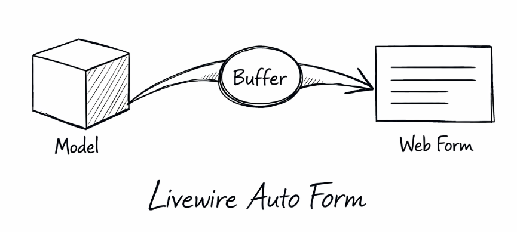

[](https://packagist.org/packages/schenke-io/livewire-auto-form)
[](https://packagist.org/packages/schenke-io/livewire-auto-form)
[](https://github.com/schenke-io/livewire-auto-form/actions/workflows/run-tests.yml)
[](https://github.com/schenke-io/livewire-auto-form/blob/main/LICENSE.md)
[](https://packagist.org/packages/schenke-io/livewire-auto-form)

<!--
********************************************************************************
*                                                                              *
*     DO NOT EDIT THIS FILE MANUALLY! IT WILL BE OVERWRITTEN.                  *
*                                                                              *
*  This file was generated by:                                                 *
*  workbench/app/Console/Commands/WriteMarkdownCommand.php
*  Source files are located in: workbench/resources/md
*                                                                              *
*     If you want to change the content, edit the source files instead.        *
*                                                                              *
********************************************************************************
-->
# <a name="livewire-auto-form"></a>Livewire Auto Form

> Enhanced livewire component to edit models and its relationships



Stop manually mapping every Eloquent attribute to a Livewire property and start focusing on your app's core logic with our buffer-based form management.

**If you struggle with the following problems, this package is for you:**

*   **Tedious property definitions:** Tired of manually adding `public string $name` for every model attribute? Our single-buffer architecture handles it all.
*   **"Forgot-to-save" bugs:** Eliminate accidental data loss with centralized state management and predictable auto-save logic.
*   **Relationship boilerplate:** Editing child models shouldn't be hard. Handle relationships with simple method calls and zero extra code.
*   **Manual option lists:** Stop hardcoding select options. Use `AutoFormOptions` to centralize labels in your Models and Enums, or rely on our smart automatic generation.
*   **Rigid workflows:** Switch between real-time "auto-save" and traditional "Save" buttons effortlessly, without rewriting your component.
*   **Complex Wizard Workflows:** Building multi-step forms usually requires manual state management for steps. Our Wizard support automates navigation and validation.
*   **Complex testing:** Logic consistency means fewer edge cases and easier unit testing for your form components.

# <a name="core-concepts"></a>Core Concepts

Livewire Auto Form follows a **buffer-based state management** pattern. Instead of binding Livewire properties directly to Eloquent model attributes, it uses an internal `$form` object (an instance of `FormCollection`) to safely stage changes.

### <a name="core-principles"></a>Core Principles

*   **State Isolation:** All form data resides in a single `$form` buffer. This prevents accidental model mutations and allows for easy "undo" or "cancel" operations. Since `$form` is a `FormCollection` (implementing `ArrayAccess`, `Countable`, `IteratorAggregate`, and `Wireable`), it provides rich state management beyond a simple array.
*   **Convention over Configuration:** By extending `AutoForm` and calling `setModel($model)`, the package manages field hydration and state transitions. Relationships and validation rules are defined in the component to maintain full control.
*   **Context Switching:** Swap the active model within the same component seamlessly. You can move between the root model and its relations, or even switch between different instances of the same model type (the **"List & Edit"** pattern). The package manages the state transition and buffer hydration automatically.
*   **Automatic Persistence:** Choose between real-time updates (`autoSave = true`) or manual submission. The package handles Eloquent `save()` calls and validation.
*   **Automatic Data Flattening:** When loading data from models, attributes implementing `Livewire\Wireable`, `Stringable`, or PHP Enums are automatically flattened to their scalar/string representation when possible. This ensures consistent data handling in the front-end and avoids serialization issues.
*   **Standardized Options:** Use the `AutoFormOptions` interface to centralize option generation for selects and radios, with an automatic fallback for quick setups.
*   **Multi-Step Workflows:** Use `AutoWizardForm` to split large forms into sequential steps with per-step validation and explicit field mapping.

This approach ensures that your components remain clean, predictable, and easy to test.

### <a name="rule-inheritance-value-normalization"></a>Rule Inheritance & Value Normalization

`AutoForm` can inherit validation rules from your Eloquent model and normalize complex value objects in a predictable way.

- Rule Inheritance: If your model exposes a `rules(): array` method, the trait will inherit those rules based on the keys you provide in `ruleKeys()`. You can also override inherited rules directly in the `rules()` method by passing them to `scanInheritedRules()`.

  Example:
  ```php
  // In your model
  public function rules(): array
  {
      return [
          'name' => 'required|string',
          'email' => 'email',
          'internal_code' => 'string',
      ];
  }

  // In your component
  public function ruleKeys(): array
  {
      return [
          'name',
          'email',
      ];
  }

  public function rules(): array
  {
      return $this->scanInheritedRules([
          'name' => 'sometimes', // overrides model rule
      ]);
  }
  ```

- Value Normalization: The internal `DataProcessor` handles special value objects:
  - Enums are flattened to their scalar representation.
  - `Stringable` objects are converted to strings.
  - `Wireable` objects that do not return an array are flattened via `toLivewire()`.

### <a name="installation"></a>Installation

```bash
composer require schenke-io/livewire-auto-form
```

# <a name="usage-patterns"></a>Usage Patterns

## <a name="editing-nested-json-attributes"></a>Editing Nested JSON Attributes

Livewire Auto Form seamlessly supports Laravel's JSON-casted attributes. When you have a model with a JSON column, you can use dot-notation in `ruleKeys()` to include specific nested keys in your form buffer.

### <a name="model-setup"></a>Model Setup
Ensure your model has the attribute cast to an array or object.

```php
class User extends Model
{
    protected $casts = [
        'settings' => 'array',
    ];

    public function rules(): array
    {
        return [
            'settings.theme' => 'required|string',
            'settings.notifications.email' => 'boolean',
        ];
    }
}
```

### <a name="component-setup"></a>Component Setup
Use `ruleKeys()` to declare the nested JSON keys you want to edit. The package will automatically hydrate the form buffer with the nested values and handle the dotted state.

```php
class EditUserSettings extends AutoForm
{
    public function mount(User $user)
    {
        $this->setModel($user);
    }

    public function ruleKeys(): array
    {
        return [
            'settings.theme',
            'settings.notifications.email',
        ];
    }

    public function rules(): array
    {
        return $this->scanInheritedRules();
    }
}
```

### <a name="blade-view"></a>Blade View
Bind your inputs to the nested keys in the `$form` object.

```html
<select wire:model.blur="form.settings.theme">
    <option value="light">Light</option>
    <option value="dark">Dark</option>
</select>

<input type="checkbox" wire:model.blur="form.settings.notifications.email">
```

The package's "Single Buffer" architecture ensures that when you save, the entire JSON structure is correctly merged and persisted back to the model attribute.

* [Livewire Auto Form](#livewire-auto-form)
* [Core Concepts](#core-concepts)
    * [Core Principles](#core-principles)
    * [Rule Inheritance & Value Normalization](#rule-inheritance-value-normalization)
    * [Installation](#installation)
* [Usage Patterns](#usage-patterns)
  * [Editing Nested JSON Attributes](#editing-nested-json-attributes)
    * [Model Setup](#model-setup)
    * [Component Setup](#component-setup)
    * [Blade View](#blade-view)
* [Code Examples](#code-examples)
    * [1. The Basic Form (Manual Save)](#1-the-basic-form-manual-save)
      * [Using scanInheritedRules with ruleKeys() to avoid duplication](#using-scaninheritedrules-with-rulekeys-to-avoid-duplication)
    * [2. Modern "Auto-Save" Experience](#2-modern-auto-save-experience)
    * [3. Handling Relationships](#3-handling-relationships)
    * [4. Using Enums for Selects](#4-using-enums-for-selects)
    * [5. Listening for Events (Notifications)](#5-listening-for-events-notifications)
    * [6. List & Edit Pattern](#6-list-edit-pattern)
    * [7. Multi-Step Wizard](#7-multi-step-wizard)
    * [8. Redirecting after Save](#8-redirecting-after-save)
* [Multi-Step Wizards](#multi-step-wizards)
    * [Magic Features](#magic-features)
    * [Configuration](#configuration)
    * [API Reference](#api-reference)
    * [Full Example](#full-example)
* [API Definitions](#api-definitions)
  * [Using AutoForm](#using-autoform)
  * [Using AutoWizardForm](#using-autowizardform)
    * [Public Properties (AutoWizardForm)](#public-properties-autowizardform)
    * [Public Methods (AutoWizardForm)](#public-methods-autowizardform)
  * [Public Properties (AutoForm)](#public-properties-autoform)
    * [The $form object (FormCollection)](#the-form-object-formcollection)
  * [View Actions (Public Interface)](#view-actions-public-interface)
    * [`edit(string $relation, int|string $id)`](#edit-string-relation-int-string-id)
    * [`add(string $relation)`](#add-string-relation)
    * [`optionsFor(string $key, ?string $labelMask = null)`](#optionsfor-string-key-string-labelmask-null)
    * [`scanInheritedRules(array $rules = [])`](#scaninheritedrules-array-rules)
    * [`save()`](#save)
    * [`cancel()`](#cancel)
    * [`delete(string $relation, int|string $id)`](#delete-string-relation-int-string-id)
  * [Calling Methods from Blade](#calling-methods-from-blade)
  * [Helper Methods](#helper-methods)
    * [`getRelationList(string $relation)`](#getrelationlist-string-relation)
    * [`isEdited(string $relation, int|string $id)`](#isedited-string-relation-int-string-id)
    * [`getModel()`](#getmodel)
    * [`getActiveModel()`](#getactivemodel)
    * [`ruleKeys()`](#rulekeys)
    * [`scanInheritedRules(array $rules = [])`](#scaninheritedrules-array-rules)
    * [`optionsFor(string $key, ?string $labelMask = null)`](#optionsfor-string-key-string-labelmask-null)
  * [Localization](#localization)
    * [JSON-based Localization](#json-based-localization)
    * [PHP-based Localization](#php-based-localization)
    * [Advanced Configuration (Replacements)](#advanced-configuration-replacements)
    * [The `AutoFormLocalisedEnumOptions` Trait](#the-autoformlocalisedenumoptions-trait)
  * [Exceptions](#exceptions)
* [Persistence & Relationship Discovery](#persistence-relationship-discovery)
  * [Strict Relationship Validation](#strict-relationship-validation)
  * [Relationship Hardening](#relationship-hardening)
* [Event System](#event-system)
  * [Available Events](#available-events)
    * [1. `saved`](#1-saved)
    * [2. `field-updated`](#2-field-updated)
    * [3. `confirm-discard-changes`](#3-confirm-discard-changes)
  * [Listening in Livewire](#listening-in-livewire)

# <a name="code-examples"></a>Code Examples

This guide provides examples for using the package, ranging from basic forms to more advanced scenarios.

> **Note on Method Calls:** Since the form logic is integrated directly into the component, you can call methods like `save()` or `edit()` directly in Blade. This ensures full compatibility with Alpine.js and component libraries like **Flux** without the need for wrapper methods. See [API Definitions](definitions.md#calling-methods-from-blade) for details.

### <a name="1-the-basic-form-manual-save"></a>1. The Basic Form (Manual Save)

#### <a name="using-scaninheritedrules-with-rulekeys-to-avoid-duplication"></a>Using scanInheritedRules with ruleKeys() to avoid duplication
You can let your models define `rules()` and inherit them in your component to keep validation logic in one place. Use `ruleKeys()` to declare which fields to inherit and pass overrides to `scanInheritedRules()` when needed.

```php
use SchenkeIo\LivewireAutoForm\AutoForm;

class EditPost extends AutoForm
{
    public function ruleKeys(): array
    {
        // Will fetch `name` and `author.email` rules from the active model
        return ['name', 'author.email'];
    }

    public function rules(): array
    {
        return $this->scanInheritedRules(
            ['author.email' => 'nullable|email'] // component override takes precedence
        );
    }
}
```

This is the simplest way to use the package. You extend `AutoForm` in your component and initialize it.

**The Livewire Component:**
```php
use SchenkeIo\LivewireAutoForm\AutoForm;

class EditPost extends AutoForm
{
    public function mount(Post $post)
    {
        $this->setModel($post);
    }

    public function rules(): array
    {
        return [
            'title' => 'required|string|min:3',
            'content' => 'required',
        ];
    }

    public function render()
    {
        return view('livewire.edit-post');
    }
}
```

**The Blade View:**
```html
<div>
    <input type="text" wire:model="form.title">
    @error('form.title') <span class="error">{{ $message }}</span> @enderror

    <textarea wire:model="form.content"></textarea>
    @error('form.content') <span class="error">{{ $message }}</span> @enderror
    
    <button wire:click="save">Save Post</button>
</div>
```

---

### <a name="2-modern-auto-save-experience"></a>2. Modern "Auto-Save" Experience

If you want your form to save automatically as the user types (on blur), just set `$this->autoSave` to `true`.

**The Livewire Component:**
```php
class EditPost extends AutoForm
{
    public function mount(Post $post)
    {
        $this->setModel($post);
        $this->autoSave = true;
    }

    public function rules(): array
    {
        return [
            'title' => 'required|string|min:3',
            'content' => 'required',
        ];
    }
}
```

**The Blade View:**
```html
<div>
    <!-- No "Save" button needed! It saves when you click away from the input (on blur) -->
    <input type="text" wire:model.blur="form.title">
    @error('form.title') <span class="error">{{ $message }}</span> @enderror

    <textarea wire:model.blur="form.content"></textarea>
    @error('form.content') <span class="error">{{ $message }}</span> @enderror
    
    <span wire:loading wire:target="save">Saving...</span>
</div>
```

---

### <a name="3-handling-relationships"></a>3. Handling Relationships

This is where the package really shines. Imagine a `Brand` that has many `Products`. You can edit the brand and its products in the same component.

**The Livewire Component:**
```php
class EditBrand extends AutoForm
{
    public function mount(Brand $brand)
    {
        $this->setModel($brand);
    }

    public function rules(): array
    {
        return [
            'name' => 'required',
            'products.name' => 'required',
            'products.price' => 'numeric',
        ];
    }

    public function render()
    {
        return view('livewire.edit-brand');
    }
}
```

**The Blade View:**
```html
<div>
    <!-- Main Brand Form -->
    <input type="text" wire:model.blur="form.name">

    <h3>Products</h3>
    <ul>
        @foreach($this->getRelationList('products') as $product)
            <li wire:key="product-{{ $product->id }}" 
                class="{{ $this->isEdited('products', $product->id) ? 'active' : '' }}">
                {{ $product->name }} - ${{ $product->price }}
                <button wire:click="edit('products', {{ $product->id }})">Edit</button>
                <button wire:click="delete('products', {{ $product->id }})">Delete</button>
            </li>
        @endforeach
    </ul>
    
    <button wire:click="add('products')">Add Product</button>

    <!-- This shows up only when we are editing or adding a product -->
    @if($activeContext === 'products')
        <div class="modal">
            <h4>{{ $activeId ? 'Edit Product' : 'Add Product' }}</h4>
            
            <!-- Relationship form is stored under the relationship name in the $form buffer -->
            <input type="text" wire:model.blur="form.products.name">
            <input type="number" wire:model.blur="form.products.price">
            
            <button wire:click="save">Save</button>
            <button wire:click="cancel">Cancel</button>
        </div>
    @endif
</div>
```

---

### <a name="4-using-enums-for-selects"></a>4. Using Enums for Selects

The primary way to handle selection elements (selects, radios, etc.) is by implementing the `AutoFormOptions` interface on your Model or Enum.

**The Enum:**
```php
enum Status: string implements AutoFormOptions
{
    case DRAFT = 'draft';
    case PUBLISHED = 'published';

    public static function getOptions(?string $labelMask = null): array
    {
        return [
            self::DRAFT->value => 'The Draft',
            self::PUBLISHED->value => 'Live on Site',
        ];
    }
}
```

**The Blade View:**
```html
<select wire:model.blur="form.status">
    <option value="">Select Status</option>
    @foreach($this->optionsFor('status') as [$value, $label])
        <option value="{{ $value }}">{{ $label }}</option>
    @endforeach
</select>
```

**Automatic Fallback:**
If you don't implement `AutoFormOptions`, the package will automatically generate readable labels from your Enum case names or Model attributes!

---

### <a name="5-listening-for-events-notifications"></a>5. Listening for Events (Notifications)

You can listen for the events dispatched by the component to show "Saved" notifications or other UI feedback.

**The Blade View (using Alpine.js):**
```html
<div x-data="{ show: false, message: '' }"
     x-on:saved.window="show = true; message = 'Changes saved!'; setTimeout(() => show = false, 2000)"
     x-on:field-updated.window="show = true; message = 'Field updated!'; setTimeout(() => show = false, 2000)">
    
    <div x-show="show" class="notification" style="display: none;">
        <span x-text="message"></span>
    </div>

    <!-- your form content ... -->
</div>
```

---

### <a name="6-list-edit-pattern"></a>6. List & Edit Pattern

You can use a single component to manage a collection of models, allowing you to select and edit any record from a list, or create a new one, all within the same view state.

**The Livewire Component:**
```php
class ManageProducts extends AutoForm
{
    public function mount()
    {
        $this->setModel(new Product);
    }

    public function rules(): array
    {
        return [
            'name' => 'required',
            'price' => 'numeric',
        ];
    }
}
```

**The Blade View:**
```html
<div>
    <!-- 1. The List -->
    <ul>
        @foreach(Product::all() as $product)
            <li>
                {{ $product->name }}
                <button wire:click="edit('', {{ $product->id }})">Edit</button>
                <button wire:click="delete('', {{ $product->id }})">Delete</button>
            </li>
        @endforeach
    </ul>

    <button wire:click="add('')">Create New Product</button>

    <hr>

    <!-- 2. The Edit/Create Form -->
    <h3>{{ $form->rootModelId ? 'Edit Product' : 'New Product' }}</h3>
    
    <input type="text" wire:model.blur="form.name">
    <input type="number" wire:model.blur="form.price">
    
    <button wire:click="save">Save Product</button>
    <button wire:click="cancel">Reset Form</button>
</div>
```

---

### <a name="7-multi-step-wizard"></a>7. Multi-Step Wizard

For complex forms, extend `AutoWizardForm` to break them into steps. It handles step navigation, explicit field mapping, and per-step validation.

**The Livewire Component:**
```php
class UserWizard extends AutoWizardForm
{
    public array $structure = [
        'profile' => ['name'],
        'address' => ['city'],
    ];
    
    public string $stepViewPrefix = 'livewire.steps.';

    public function rules(): array
    {
        return [
            'name' => 'required',
            'city' => 'required',
        ];
    }
    
    public function mount(User $user)
    {
        $this->setModel($user);
        parent::mount();
    }
}
```

**The Main Blade View:**
```html
<form wire:submit.prevent="submit">
    @foreach($this->getSteps() as $index => $step)
        @include('livewire.steps.' . $step, ['isActive' => $this->isStepActive($index)])
    @endforeach

    <button type="submit">{{ $this->isLastStep() ? 'Finish' : 'Next' }}</button>
</form>
```

---

### <a name="8-redirecting-after-save"></a>8. Redirecting after Save

If you need to perform actions after a successful save, such as redirecting the user to another page, you can easily override the `save()` method in your component.

**The Livewire Component:**
```php
class CreatePost extends AutoForm
{
    public function mount(Post $post)
    {
        $this->setModel($post);
    }

    public function rules(): array
    {
        return [
            'title' => 'required',
            'content' => 'required',
        ];
    }

    public function save(): void
    {
        // 1. Call the parent save logic to persist the data
        parent::save();

        // 2. Perform your redirect
        $this->redirect(route('posts.index'));
    }
}
```

# <a name="multi-step-wizards"></a>Multi-Step Wizards

The `AutoWizardForm` extends the core `AutoForm` functionality to support complex, multi-step workflows with ease. It handles step navigation, per-step validation, and a unified submission flow.

### <a name="magic-features"></a>Magic Features

- **Unified `submit()` Flow**: A single `submit()` method handles both navigating to the next step (with validation) and final persistence when the last step is reached.
- **Progress Integrity**: Before final saving, the wizard performs an integrity check to ensure that all fields defined in your `rules()` were actually present in at least one of the steps. If any field is missing, a `LivewireAutoFormException` is thrown.

### <a name="configuration"></a>Configuration

To create a wizard, extend `AutoWizardForm` and configure the following:

- **`$structure`**: A map of Blade view names to field names (e.g., `['step-one' => ['field1', 'field2'], 'step-two' => ['field3']]`).
- **`$stepViewPrefix`**: A prefix for the views defined in `$structure` (e.g., `livewire.user-wizard-steps.`).
- **`rules()`**: Define your validation rules.
- **`mount()`**: Initialize the model with `setModel($model)`.

### <a name="api-reference"></a>API Reference

| Method | Description |
| --- | --- |
| `submit()` | Handles both transitions and final saving. Calls `next()` or `save()`. |
| `next()` | Validates current step's fields and moves forward. |
| `previous()` | Moves to the previous step. |
| `isLastStep()` | Returns `true` if on the final step. |
| `getSteps()` | Returns the list of defined step views. |
| `isStepActive(int $index)` | Checks if a step is currently active. |

### <a name="full-example"></a>Full Example

**1. The Livewire Component:**

```php
namespace App\Livewire;

use App\Models\User;
use SchenkeIo\LivewireAutoForm\AutoWizardForm;

class UserWizard extends AutoWizardForm
{
    public array $structure = [
        'profile' => ['name', 'email'],
        'address' => ['city'],
        'preferences' => ['marketing_opt_in']
    ];
    
    public string $stepViewPrefix = 'livewire.user-wizard-steps.';

    public function mount(User $user)
    {
        $this->setModel($user);
        parent::mount();
    }

    public function rules(): array
    {
        return [
            'name' => 'required|min:3',
            'email' => 'required|email',
            'city' => 'required',
            'marketing_opt_in' => 'boolean',
        ];
    }
}
```

**2. The Main Blade View (`user-wizard.blade.php`):**

```html
<form wire:submit.prevent="submit">
    @foreach($this->getSteps() as $index => $step)
        @include('livewire.user-wizard-steps.' . $step, [
            'isActive' => $this->isStepActive($index)
        ])
    @endforeach

    <div class="actions">
        @if($currentStepIndex > 0)
            <button type="button" wire:click="previous">Previous</button>
        @endif

        <button type="submit">
            {{ $this->isLastStep() ? 'Finish' : 'Next' }}
        </button>
    </div>
</form>
```

**3. Individual Step View (`profile.blade.php`):**

```html
<div class="{{ $isActive ? 'block' : 'hidden' }}">
    <input type="text" wire:model="form.name">
    <input type="email" wire:model="form.email">
</div>
```

# <a name="api-definitions"></a>API Definitions

The package provides two main classes for managing form state and persistence: `AutoForm` and `AutoWizardForm`. These classes are **Base Components**, offering a context-aware **"Single Buffer"** architecture.

## <a name="using-autoform"></a>Using AutoForm

To use the package, extend `AutoForm` in your Livewire component and initialize it in the `mount()` method:

```php
use SchenkeIo\LivewireAutoForm\AutoForm;

class MyComponent extends AutoForm
{
    public function mount(User $user)
    {
        $this->setModel($user);
    }

    public function rules(): array
    {
        return $this->scanInheritedRules();
    }

    public function ruleKeys(): array
    {
        return [
            'name',
            'email',
            'posts.title' // Relation support
        ];
    }
}
```

## <a name="using-autowizardform"></a>Using AutoWizardForm

For multi-step workflows, extend `AutoWizardForm`. It provides step management and per-step validation.

See the [Multi-Step Wizards](wizard.md) guide for details.

### <a name="public-properties-autowizardform"></a>Public Properties (AutoWizardForm)

| Property | Type | Description |
| --- | --- | --- |
| `$currentStepIndex` | `int` | The zero-based index of the current active step. |
| `$structure` | `array` | Map of Blade view names to field names. |
| `$stepViewPrefix` | `string` | Prefix for the step Blade views. |

### <a name="public-methods-autowizardform"></a>Public Methods (AutoWizardForm)

| Method | Description |
| --- | --- |
| `submit()` | Handles navigation (next step) or final submission (if on last step). |
| `next()` | Validates current step and moves forward. |
| `previous()` | Moves to the previous step. |
| `isLastStep()` | Returns `true` if on the final step. |
| `getSteps()` | Returns the list of defined step views. |
| `isStepActive(int $index)` | Checks if a step is currently active. |
| `getStepFields(int $index)` | Returns the fields associated with a specific step. |

## <a name="public-properties-autoform"></a>Public Properties (AutoForm)

| Property | Type | Description |
| --- | --- | --- |
| `$autoSave` | `bool` | Default `false`. If `true`, fields are saved on every update (on blur). If `false`, you must call `save()` manually. |
| `$form` | `FormCollection` | The internal state container (read-only from outside). |

### <a name="the-form-object-formcollection"></a>The $form object (FormCollection)

The `$form` object contains the following state properties:

| Property | Type | Description |
| --- | --- | --- |
| `activeContext` | `string` | Current editing context: `''` for root model or a relation name. |
| `activeId` | `int|string|null` | ID of the record being edited. `null` indicates "Add Mode". |
| `rootModelClass` | `string` | The class name of the main model. |
| `rootModelId` | `int|string|null` | The ID of the main model instance. |
| `autoSave` | `bool` | Whether auto-save is currently enabled. |

## <a name="view-actions-public-interface"></a>View Actions (Public Interface)

### <a name="edit-string-relation-int-string-id"></a>`edit(string $relation, int|string $id)`
Switches the context to edit a record.
- **Related record**: `wire:click="edit('posts', {{ $post->id }})"`
- **Root model**: `wire:click="edit('', {{ $otherId }})"`

### <a name="add-string-relation"></a>`add(string $relation)`
Switches the context to "Add Mode".
- **Related record**: `wire:click="add('posts')"`
- **New root model**: `wire:click="add('')"`

### <a name="optionsfor-string-key-string-labelmask-null"></a>`optionsFor(string $key, ?string $labelMask = null)`
Generates option arrays for selects based on Enums or Eloquent relations.
- **$key**: The field name or relation name.
- **$labelMask**: Optional mask for labels (e.g., `(first_name) (last_name)`).

### <a name="scaninheritedrules-array-rules"></a>`scanInheritedRules(array $rules = [])`
Automatically scans the model and its relations for validation rules defined in `rules()` or `casts()`.
- **$rules**: Optional base rules to merge with.

### <a name="save"></a>`save()`
Validates and persists the current buffer data.
- If editing a relation, it returns to root context after saving.
- If creating a root model, it updates `rootModelId` after the first save.

### <a name="cancel"></a>`cancel()`
Resets context to root (`''`) and reloads data to discard changes.

### <a name="delete-string-relation-int-string-id"></a>`delete(string $relation, int|string $id)`
Deletes or detaches a record and updates the active context.

## <a name="calling-methods-from-blade"></a>Calling Methods from Blade

Since the form logic is now part of the Component itself, you can call methods directly in Blade without any special wrappers:

```html
<button wire:click="save">Save</button>
```

This is fully compatible with Alpine.js and component libraries like **Flux**.

## <a name="helper-methods"></a>Helper Methods

### <a name="getrelationlist-string-relation"></a>`getRelationList(string $relation)`
Returns a collection of related models for the given relation name.
- **Example**: `@foreach($this->getRelationList('posts') as $post)`

### <a name="isedited-string-relation-int-string-id"></a>`isEdited(string $relation, int|string $id)`
Returns `true` if the specified related record is currently being edited.
- **Example**: `<li class="{{ $this->isEdited('posts', $post->id) ? 'active' : '' }}">`

### <a name="getmodel"></a>`getModel()`
Returns the root model instance with current buffer data applied.

### <a name="getactivemodel"></a>`getActiveModel()`
Returns the model instance for the current active context (root or relation) with current buffer data applied.

### <a name="rulekeys"></a>`ruleKeys()`
Defines which model fields are included in the form and should have their validation rules inherited. Returns an array of strings (e.g., `['name', 'posts.title']`).

### <a name="scaninheritedrules-array-rules"></a>`scanInheritedRules(array $rules = [])`
Scans for rules from the active model and its relationships. This is used by the default `rules()` implementation to avoid duplicating validation rules already defined in your Eloquent models.

- `$rules`: Optional starting array of rules (component rules take precedence). The method automatically uses the keys returned by `ruleKeys()`.

Returns the merged rules array.

**Validation Flexibility**: If a key in `ruleKeys()` cannot be resolved on the active model or if a relationship path is invalid, it defaults to `nullable` instead of throwing an exception. This allows for quick prototyping and optional fields.

### <a name="optionsfor-string-key-string-labelmask-null"></a>`optionsFor(string $key, ?string $labelMask = null)`
Universal helper for fetching [value => label] pairs for selection elements (selects, radios, checkboxes).

**Usage in Blade:**
```html
<select wire:model.blur="form.status">
    @foreach($this->optionsFor('status') as [$value, $label])
        <option value="{{ $value }}">{{ $label }}</option>
    @endforeach
</select>
```

**Primary Usage (`AutoFormOptions` Interface)**

The recommended way to provide options is by implementing the `AutoFormOptions` interface on your Model or BackedEnum. This centralizes the logic and supports custom label formatting via the `$labelMask`.

```php
class Country extends Model implements AutoFormOptions 
{
    public static function getOptions(?string $labelMask = null): array 
    {
        return self::pluck('name', 'id')->toArray();
    }
}
```

**Automatic Fallback**

If the target class does not implement `AutoFormOptions`, the system uses an automatic generation strategy:

- **Models (Relations)**:
    - If `$labelMask` is null, it uses the `name` column.
    - If `$labelMask` is a string (e.g., `'title'`), it uses that column as the label.
    - If `$labelMask` contains placeholders in parentheses, it replaces them with the corresponding column values, e.g., `(first_name) (last_name)`.
- **Enums**: 
    - If `$labelMask` is null, it generates a headline from the case name (e.g., `ACTIVE_STATUS` -> `Active Status`).
    - If `$labelMask` is provided, it must contain `(name)` or `(value)` keywords in parentheses.

Labels generated via the fallback are automatically localized using Laravel's `__()`.

## <a name="localization"></a>Localization

The package supports both JSON and PHP-based localization storage. All labels generated for select options, whether via `AutoFormOptions` or the automatic fallback, are passed through Laravel's `__()` helper.

### <a name="json-based-localization"></a>JSON-based Localization
Useful for full-sentence labels.
```json
{
    "Active": "User is Active",
    "Pending": "User is Pending"
}
```

### <a name="php-based-localization"></a>PHP-based Localization
Useful for structured keys.
```php
// lang/en/enums.php
return [
    'status' => [
        'active' => 'Active User',
        'pending' => 'Review Pending'
    ]
];
```

### <a name="advanced-configuration-replacements"></a>Advanced Configuration (Replacements)
You can provide translation replacements by returning an array from `getOptions()`:
```php
public static function getOptions(?string $labelMask = null): array {
    return [
        'active' => [
            'key' => 'enums.status.active_count', 
            'replace' => ['count' => User::where('active', true)->count()]
        ]
    ];
}
```

### <a name="the-autoformlocalisedenumoptions-trait"></a>The `AutoFormLocalisedEnumOptions` Trait
For Enums, you can use the `AutoFormLocalisedEnumOptions` trait to automate key generation:
```php
enum UserStatus: string implements AutoFormOptions {
    use AutoFormLocalisedEnumOptions;
    const OPTION_TRANSLATION_PREFIX = 'enums.user_status';

    case ACTIVE = 'active';
}
```
This automatically resolves to the translation key `enums.user_status.active`. You can also override the prefix dynamically by passing it as the `$labelMask` to `optionsFor('status', 'custom.prefix')`.

## <a name="exceptions"></a>Exceptions

The package throws `SchenkeIo\LivewireAutoForm\Helpers\LivewireAutoFormException` for:
- **Configuration Integrity**: Errors in setup.
- **Rules Discrepancy**: Mismatches between data and `rules()`.
- **Relation Errors**: Unsupported relationship types.
- **Enum Errors**: Missing enum casts.

# <a name="persistence-relationship-discovery"></a>Persistence & Relationship Discovery

Livewire Auto Form features a hardened persistence layer that ensures data is correctly routed between your form buffer and the database, with a specific focus on Eloquent relationships.

## <a name="strict-relationship-validation"></a>Strict Relationship Validation

The package distinguishes between actual Eloquent relationships and other dot-notated data (such as JSON casts or nested arrays) by using the model's `isRelation()` method.

When you define dot-notated rules like:

```php
public function rules(): array
{
    return [
        'author.name' => 'required', // Eloquent relation
        'settings.theme' => 'string', // JSON cast field
    ];
}
```

The package performs the following validations:

1.  **Rule Discovery**: During initialization and rule inheritance, only keys that correspond to verified Eloquent relations are treated as relationship contexts.
2.  **Persistence Protection**: When saving data, the package verifies that a path segment is an actual relationship before attempting to invoke it as a method on the model.

If a dot-notated key does not correspond to a relationship, it is treated as a standard model attribute, allowing it to work seamlessly with Laravel's built-in support for JSON casts.

## <a name="relationship-hardening"></a>Relationship Hardening

The `CrudProcessor` has been hardened to prevent common errors when dealing with complex relationship trees:

-   **Path Resolution**: When resolving nested relationships (e.g., `brand.category.name`), every segment of the path is validated against the model's relationship definitions.
-   **Error Handling**: If a path segment is not a valid relation, a `LivewireAutoFormException` is thrown, providing clear feedback on the configuration error instead of failing with a `BadMethodCallException`.
-   **Safe Method Invocation**: Before calling a relationship method during the save process, the package explicitly checks if it exists and is a valid relation, preventing accidental execution of other model methods.

# <a name="event-system"></a>Event System

Livewire Auto Form dispatches several browser events that you can listen for in Alpine.js or Livewire to provide real-time feedback to your users.

## <a name="available-events"></a>Available Events

### <a name="1-saved"></a>1. `saved`
Dispatched after the entire form (or the active relationship context) has been successfully persisted to the database.

**Parameters:**
- `context` (string): The relationship context that was saved (empty string for the root model).
- `id` (int|string|null): The ID of the model that was saved.

**Example (Alpine.js):**
```html
<div x-on:saved.window="alert('Saved model ' + $event.detail.id + ' in context ' + $event.detail.context)">
    <!-- ... -->
</div>
```

---

### <a name="2-field-updated"></a>2. `field-updated`
Dispatched when an individual field is automatically saved to the database (only when `autoSave` is enabled).

**Parameters:**
- `changed` (string): The name of the field that was updated.
- `context` (string): The relationship context where the change occurred.
- `id` (int|string|null): The ID of the model that was updated.

**Example (Alpine.js):**
```html
<div x-on:field-updated.window="console.log('Field ' + $event.detail.changed + ' was updated!')">
    <!-- ... -->
</div>
```

---

### <a name="3-confirm-discard-changes"></a>3. `confirm-discard-changes`
Dispatched when a user action might result in losing unsaved changes in the buffer. This only happens when `autoSave` is disabled and the form buffer is not empty.

**Parameters:**
None.

---

## <a name="listening-in-livewire"></a>Listening in Livewire

You can also listen for these events in other Livewire components using the `#[On]` attribute:

```php
use Livewire\Attributes\On;

#[On('saved')]
public function handleSave($context, $id)
{
    // Do something when a model is saved
}
```


---

Markdown file generated by [schenke-io/packaging-tools](https://github.com/schenke-io/packaging-tools)
